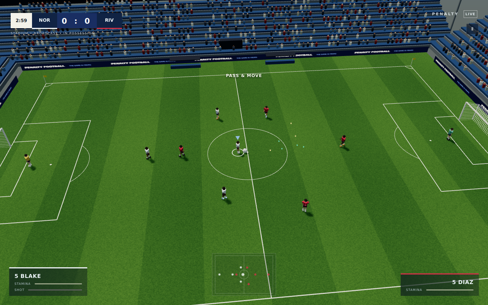

# Penalty • Five-a-side

A static, procedural 3D arcade soccer game: 4 outfield players and a goalkeeper per team. No build, backend, accounts, asset downloads, or runtime CDN dependency. Three.js 0.170.0 is vendored in `libs/`, with its MIT license.

## Play locally

From the repository root:

```sh
python3 -m http.server 8000
```

Open http://localhost:8000. Use HTTP rather than opening the HTML file directly: ES modules and the offline service worker need a server. Audio starts when you press Play match. Service workers work on localhost or HTTPS; wait for the first cache installation before going offline.

## GitHub Pages

Entry point: **`index.html` at the repository root**.

1. Push these files to `main`.
2. Settings → Pages → Deploy from branch → `main` / **root** → Save.
3. Open `https://xerox-gh.github.io/Penalty/` once deployment finishes.

All asset URLs are relative. The vendored engine and game modules are precached in the repository's service-worker scope. Bump `CACHE` in `sw.js` when publishing updates.



## Reference-inspired stadium update

The new look blends a readable retro football presentation with a wider broadcast camera and modern stadium details: procedurally textured grass, four-sided terraces, individual instanced spectators, slim articulated low-poly players, compact scoreboard and paired player-name panels. All visuals are generated by the game.

- **Stadium** is the default, with open touchlines and kick-ins, corners and goal kicks. **Arena** retains the rebound boards.
- Choose Broadcast, Tactical, Classic or Player camera in setup; C cycles them during play.
- Hold **Z** for close control. Hold Z while releasing Space for a placed, curling shot.
- **Shift + E** passes and sends the original passer on a forward run, with control switching to the receiver.
- Gamepad **LT** is precision, **RT** is through ball, and **RB + B** is pass-and-run. Local P2 uses apostrophe for precision.
- Touch adds CONTROL and THROUGH buttons. Hold CONTROL with SHOOT for a placed shot, or RUN with PASS for a forward run.

Tune `CFG.control` for touch distances, dribble spring, precision speed, finesse power/spin, tackle reach and run duration. This remains an original 5v5 arcade game with simplified set pieces, not an exact recreation of the games in the references.

## Offline club update

The title screen now opens your club hub:

- **Career:** a six-club, ten-match season, league table and results. Finish in the top two to progress from Division 3 to Division 1. Difficulty rises with division. Season champions collect a trophy.
- **Knockout cup:** quarter-final, semi-final and final, with golden goal and a trophy for three wins.
- **Challenges:** come back from 0–2, win without conceding, or score three in 90 seconds. First completions award badges and bonus packs.
- **Squad & cards:** 24 fictional players across four rarities. Equip owned cards in five position-specific slots. Card attributes grant modest pace, shot-power and pass-speed bonuses (roughly 0–5%). Packs contain three cards, guarantee one new card while the album is incomplete, and turn duplicates into 20 coins.
- **Quests:** ten one-time milestones and three repeating contracts. Claim all contracts to refresh the board. Match rewards, quests and level-ups earn coins, XP and packs; every 300 XP grants a pack.
- **My club:** unlock five kit colors with earned coins, view trophies and records, and export/import your save.

Players now have varied hair styles/colors, faces, ears, collars, cuffs, crests, detailed boots, keeper gloves and named/numbered shirts. Geometry and most materials remain shared.

Everything runs locally, including fixtures, card draws and rewards. No purchases, accounts, server, calendar timers or network checks. Your browser stores progress in `localStorage`. **Export a backup before clearing browser data or moving to another device/address.** Import replaces the current club; malformed saves are rejected. If browser storage fails, the hub says progress is session-only and still allows export. Unreadable existing saves are preserved for recovery rather than overwritten.

Leaving a match or reloading keeps the pending fixture. Resume restarts it from kickoff; abandon earns nothing. Results and quest rewards are applied only once. This is a compact club career, without transfers, player aging, individual player careers or a full management simulation. Quick Match still provides custom settings and local two-player play.

Tune the catalog, rewards, challenges and fixtures in `js/progression.js`; `js/club.js` contains the hub. Card attribute multipliers are in `js/player.js`. The save schema is versioned; changing it requires a migration or a new save key.

## Controls

| Action | Player 1 | Local player 2 | Gamepad |
|---|---|---|---|
| Move | WASD; arrows in solo mode | Arrows | Left stick |
| Sprint | Left Shift | Right Shift | RB |
| Shoot | Hold Space, release | Hold Enter, release | Hold A, release |
| Pass | E | / | B |
| Through ball | R | ; | RT |
| Chip | Q | . | X |
| Slide | F | , | Y |
| Switch | Tab | Backspace | LB |
| Close control / placed shot modifier | Z | Apostrophe | LT |
| Pass and run | Shift + E | Right Shift + / | RB + B |
| Camera | C | Shared | — |
| Pause | P / Esc | Shared | — |
| Mute | M | Shared | — |

Touch devices display a joystick and eight action buttons. Use movement direction to aim passes and choose the finish; close-range shots are assisted. Neutral-stick switching selects a player near the ball; switching with movement favors that direction. Auto-switch can be disabled in setup. The home team attacks the right-hand (+X) goal for the whole match.

## Included

- 2 / 3 / 5-minute matches, optional golden goal, local keyboard versus mode, three difficulties, team names/colors and three formations.
- Fixed 60 Hz ball simulation: gravity, bounce, drag, rolling friction, sidespin, player/post/crossbar/board collisions. Lofted balls can leave the pitch and trigger kick-ins, corners or goal kicks.
- Role anchors shift with play, at most two AI outfield chasers per team, marking, scored passing lanes, shooting and goalkeeper prediction/catch/parry/distribution.
- Lineup, countdown, kickoff, goal camera/celebration, pause, full-time and replay match flow.
- Four cameras, procedural players/net/striped grass/crowd/floodlights, instanced crowd, shadows, particles, radar, stamina, shot meter, synth audio and volume/mute.
- Low/Medium/High quality and automatic downgrade after sustained rendering below 40 FPS. Hidden tabs pause matches.

## Tuning / scope

`js/config.js` holds pitch dimensions, player speeds/stamina, ball constants, formation anchors, difficulty and timing. Goalkeepers and field-player heuristics live in their respective modules. This is an arcade implementation: no fouls, cards, offside, substitutions or halftime. Restarts take 1.5 seconds and automatically position the nearest outfield taker. The goal camera is a live celebration swing, not a recorded replay. Audio is synthesized; crowd ambience is filtered noise. No multiplayer networking.

Low-poly procedural animations cover running, kicking, sliding, diving and celebration; these are simple rigid-part poses, not skeletal motion capture. The offline career keeps the current season’s results and club statistics. Quality performance varies by GPU; use Low on older hardware.

## Progression validation

Desktop and mobile-emulated Chromium checks passed for the hub, pack reveal, career start/finish, reward claims, backup download/import, offline reload/play and pending-fixture resume, with no console errors or missing assets under `/Penalty/`.

Run `node tests/progression.mjs` with a current Node.js version. Tests cover all 30 directed league pairings, a complete season and promotion, cup wins/elimination/restarts, all challenges, single-claim rewards, card completion, position rules, kits, save reload, malformed imports, corrupt-save recovery and storage failure. The game itself requires no Node.js or build step.

## Validation performed

`node tests/smoke.mjs` checks both goals, kick-ins, corners, goal kicks, board bounce, gravity, shots, keeper catch/distribution, formations, golden goal/full-time and a 180-second simulation with all ten players. JavaScript syntax and HTTP asset paths under `/Penalty/` were also checked. Headless Chromium rendered the game without console errors, accepted movement/shot/pass/camera input, exercised pause/resume, goal/golden-goal/full-time, and reloaded successfully offline after service-worker installation. The richer stadium and articulated players add detail; previous draw-call and triangle counts no longer describe the current scene. The latest update also checks placed shots, pass-and-run, both pitch-rule modes, and mobile portrait touch targets in Chromium emulation. Real-device Chrome/Firefox/Safari/Edge and physical gamepad validation remain outstanding. The headless browser uses software rendering, so neither simulation timing nor these checks establish 60 FPS on real hardware.

## Test checklist

- [ ] Load `/Penalty/` under a repository subpath; all imports and CSS return 200.
- [ ] No browser console errors or missing assets.
- [ ] Ten players stay on pitch, keep formation and contest possession.
- [ ] Move/sprint/pass/charge shot/chip/slide/switch, score into both goals.
- [ ] Check keeper saves/distribution, kick-ins, goal kicks and corners.
- [ ] Pause/resume, hide tab, finish match, golden goal, play again.
- [ ] Test local P2 and a standard-mapping gamepad.
- [ ] Test mobile joystick/buttons in portrait and landscape.
- [ ] First online load installs service worker; reload and play offline.
- [ ] Smoke-test current Chrome, Firefox, Safari and Edge on real devices.

- [ ] Open a pack, equip a card, complete a career fixture and claim a quest.
- [ ] Reload and verify coins, squad and league progress persist.
- [ ] Export/import a backup; malformed imports must preserve the existing club.
- [ ] Resume an unfinished fixture offline and verify it starts at kickoff.
